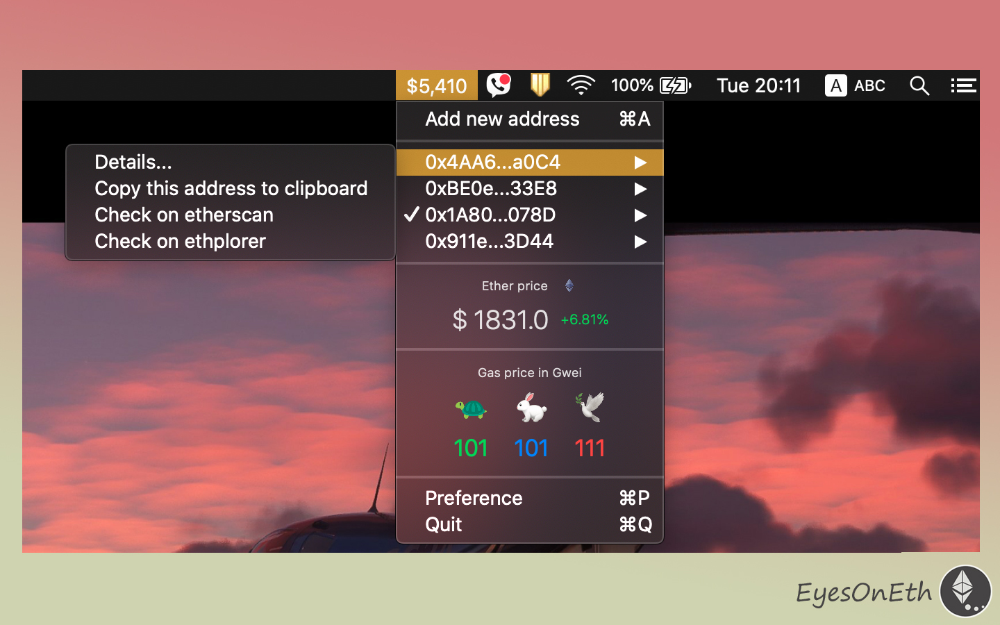
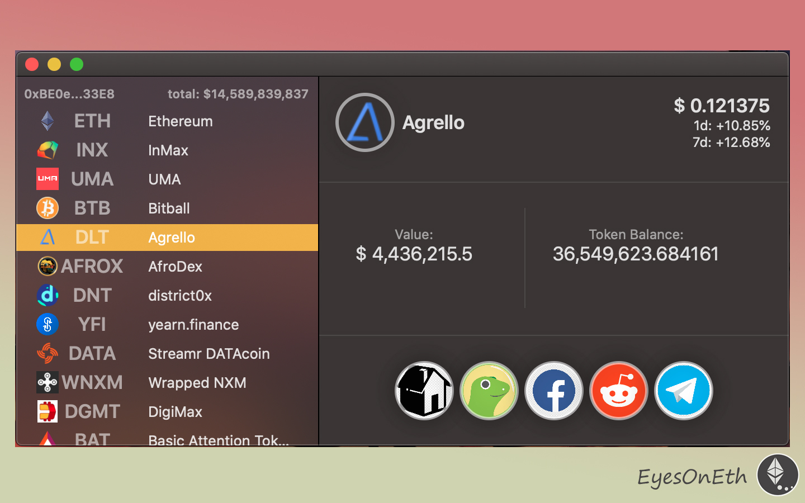

# EyesOnEth

> Essential Ethereum Tool for MacOS [Web](https://eyesonethweb.gtsb.io/about)

Simple and Light!
Essential macOS menu bar app for your Ethereum wallets! 

Features : 
- Monitor Ethereum wallet balance on the menu bar 
- Check the current Ethereum and gas price
- Support multiple addresses 
- Track Ethereum and ERC-20 coin price and balance 
- Display essential information only for crypto investors
- Quick access to useful links for each coins in the address
- Store wallet address data only in the local storage
- Minimum cpu and memory usage

This app utilizes APIs from
- Coingecko
- Etherscan
- Ethplorer

## Install
 
[EyesOnEth-1.0.2.dmg](https://github.com/felixinjapan/EyesOnEth/raw/main/EyesOnEth-1.0.2.dmg)

